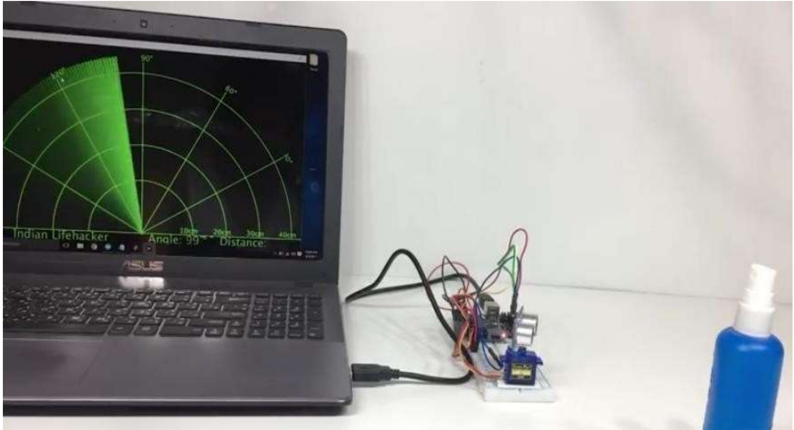

# Arduino Radar for Object Detection 

This project implements a low-cost radar system using an Arduino UNO, ultrasonic sensor, and servo motor. The system scans a 180° area, detects objects, and visualizes them in real time using the Processing IDE.

## Features
- Real-time object detection and distance tracking
- Servo motor-based radar sweep
- 180° scanning arc with obstacle mapping
- Visualization of radar sweep on PC using Processing

## Components Used
- Arduino UNO  
- HC-SR04 Ultrasonic Sensor  
- SG90 Servo Motor  
- USB Cable  
- Breadboard & Jumper Wires  
- Processing IDE (for PC visualization)

##  Project Structure
```
arduino-radar-object-detection/
├── radar.ino
├── Arduino Radar for object detection.pdf
├── images/
│   └── radar-demo.png
└── README.md

```

## How to Use

### 1. Hardware Setup
- Connect the ultrasonic sensor and servo motor to the Arduino UNO as per the circuit diagram.
- Mount the ultrasonic sensor on the servo for dynamic angle rotation.

### 2. Upload Code to Arduino
- Open `radar.ino` from the `Arduino_Code/` folder.
- Upload it to your Arduino UNO using the Arduino IDE.


##  Demo


##  Concepts Covered
- Ultrasonic distance measurement
- Servo motor control (PWM)
- Serial communication between Arduino and PC
- Real-time graphical visualization with Processing

##  Applications
- Proximity detection
- Robotic obstacle avoidance
- Low-cost radar simulation for learning purposes

## License
This project is licensed under the [MIT License](LICENSE).

## Contributing
Contributions are welcome! Feel free to fork this repository and submit a pull request.

## Contact
For questions or suggestions, reach out via [GitHub Issues](https://github.com/your-username/arduino-radar-object-detection/issues).

